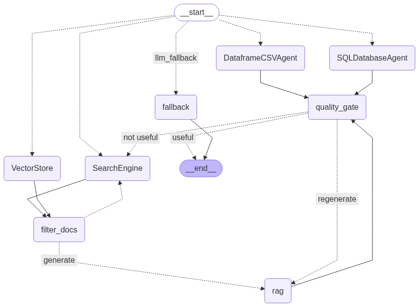

# enterprise-ai-assistant



# 🤖 Multi-Agent AI Assistant (LangGraph + Streamlit)

This project is a **multi-agent system** built with **LangGraph** and a **Streamlit frontend**.  
It supports multiple structured and unstructured data tools:

- 🐼 **Dataframe Agent** → Query CSV/Excel files using Pandas
- 🗄 **SQL Agent** → Query SQL databases (SQLite/Postgres/MySQL)
- 📄 **RAG Agent** → Retrieve answers from uploaded documents
- 🌍 **Search Agent** → Perform web searches for external knowledge

---

## 🚀 Features

- Upload **CSV** files for DataFrame analysis  
- Upload **SQLite DB** for SQL queries  
- Upload **PDF/TXT/DOCX** for RAG (document Q&A)  
- Automatic **query routing** to the correct tool (CSV, SQL, RAG, or Search)  
- **LangGraph orchestration** with multi-agent nodes  
- **Streamlit frontend** (no Flask needed)

---

## 🛠 Installation

```bash
git clone https://github.com/Vishnuu011/enterprise-ai-assistant
cd enterprise-ai-assistant
pip install -r requirements.txt
